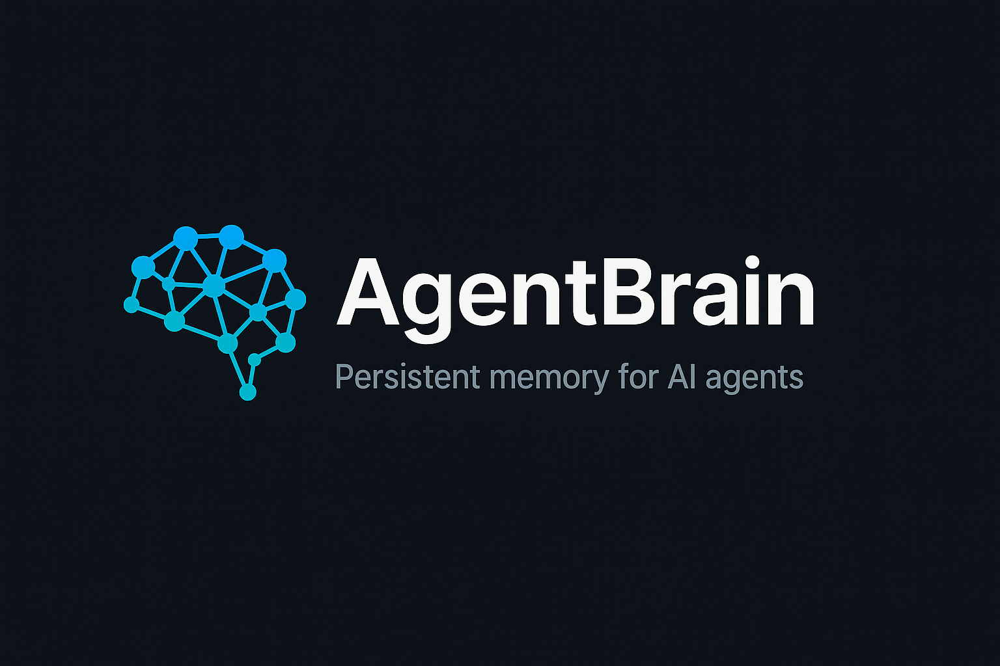

<p align="center">
  
</p>

<p align="center">
  <strong>Your AI forgets everything every session. Fix that.</strong>
</p>

---

**Monday:**
> "I think SOL will rally Q3 based on ETF inflows. Track this at 65% confidence."

**Wednesday** *(new session, context wiped):*
> "What's our current thinking on SOL?"
> → *"I don't have any information about previous conversations..."*

**With AgentBrain:**
> → *"You have an open hypothesis: SOL Q3 rally, 65% confidence, based on ETF inflows. No new evidence since Monday. Want me to check for updates?"*

**That's not context. That's memory.**

---

## Install (2 minutes)

```bash
git clone https://github.com/YOURUSER/agentbrain-starter.git
cp agentbrain-starter/templates/* ~/.openclaw/workspace/
```

1. Edit `SOUL.md` — give your agent a name and personality
2. Edit `USER.md` — tell it who you are and what you're building
3. Tell your agent: **"Read AGENTS.md — you have a new memory system."**

**In 2 minutes**, your agent stops starting from zero. It knows who it is, who you are, and what you were working on.

**Over time**, memory compounds. Decisions persist. Context builds. Your agent gets sharper the longer you use it.

---

## How It Works

```
┌─────────────────────────────────────────────────────┐
│                   SESSION START                      │
│                                                     │
│   Agent reads: SOUL.md → USER.md → MEMORY.md        │
│   "I know who I am, who you are, and what we        │
│    were working on."                                 │
└──────────────────────┬──────────────────────────────┘
                       │
                       ▼
┌─────────────────────────────────────────────────────┐
│                  DURING SESSION                      │
│                                                     │
│   Agent works normally. Learns new things.           │
│   Makes decisions. Gets new information.             │
└──────────────────────┬──────────────────────────────┘
                       │
                       ▼
┌─────────────────────────────────────────────────────┐
│                   SESSION END                        │
│                                                     │
│   Write-back checklist triggers:                     │
│   ✓ Did any belief change? → Update file             │
│   ✓ Was a decision made? → Log to MEMORY.md          │
│   ✓ New fact about the human? → Update USER.md       │
│   ✓ Mistake made? → Record the lesson                │
└──────────────────────┬──────────────────────────────┘
                       │
                       ▼
          ┌────────────────────────┐
          │  Files updated on disk  │
          │  ↩ Next session reads   │
          │    them on startup      │
          └────────────────────────┘
```

The key insight: **most agents lose knowledge not because they can't store it, but because nothing tells them to write it down before the session ends.** The write-back checklist fixes that.

---

## What's Included

```
templates/
  SOUL.md               — Agent identity and personality
  USER.md               — Who you are (agent's cheat sheet about you)
  AGENTS.md             — Session startup protocol
  MEMORY.md             — Long-term curated memory (grows over time)
  session-checklist.md  — Write-back checklist (prevents knowledge loss)
docs/
  compaction-recovery.md — How your agent recovers from context resets
```

Every file has fill-in-the-bracket prompts. Edit, save, done.

---

## What Happens After Week 3

This starter kit works immediately. But after a few weeks, you'll hit the natural ceiling of flat-file memory:

- Daily logs pile up with no automatic cleanup
- MEMORY.md gets bloated — no structure to separate facts from guesses
- Old context gets buried and hard to find
- No way to track what's been tested vs. what's still a hunch

When you hit that wall, **AgentBrain Standard** ($19) adds auto-archive, full-text search, frontmatter validation, and structured hypothesis tracking — everything you need to keep memory clean as it grows.

**AgentBrain Pro** ($39) adds an interactive knowledge graph, typed relationship queries, and autonomous goal trees — your agent works while you sleep.

Coming soon.

---

## FAQ

**Does this only work with OpenClaw?**
Built for OpenClaw, but the architecture works with any agent that reads files from a workspace directory.

**Do I need to code anything?**
No. Edit markdown files. That's it.

**What model does it work with?**
Any. Claude, GPT-4, Gemini, Llama — if it can read a file, it works.

**How is this different from custom instructions?**
Custom instructions are static. AgentBrain files are dynamic — your agent updates them during sessions, so memory compounds over time instead of going stale.

---

<p align="center">
  Built from the same memory system our AI agent relies on daily.
</p>
