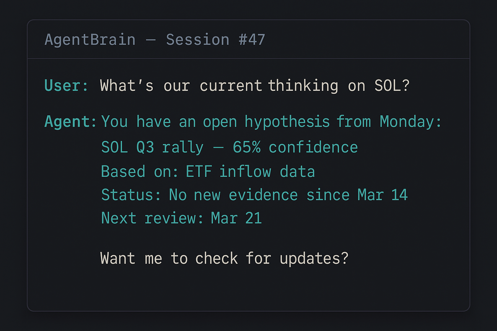

<p align="center">
  
</p>

<h3 align="center">Your AI forgets everything. Fix that.</h3>

<p align="center">
  The memory layer for AI agents. No database. No infrastructure. Just markdown files<br>that give your agent persistent, compounding memory across every session.
</p>

<p align="center">
  <a href="https://github.com/yurdme69/AgentBrain-starter/blob/main/LICENSE"></a>
  <a href="#quick-start"></a>
  <a href="#works-with"></a>
</p>

<p align="center">
  <a href="#quick-start">Quick Start</a> •
  <a href="#the-problem">The Problem</a> •
  <a href="#how-it-works">How It Works</a> •
  <a href="#works-with">Compatibility</a> •
  <a href="#whats-included">What's Included</a> •
  <a href="#faq">FAQ</a>
</p>

---

<p align="center">
  
</p>

<p align="center"><em>Session 47. The agent remembers a hypothesis from Monday — confidence level, evidence, next review date. Zero re-explaining.</em></p>

---

## The Problem

Every AI agent starts from zero every session. It doesn't know your name, your projects, or the decision you made yesterday. You re-explain everything. Every time.

This isn't a model problem. GPT-4, Claude, Gemini — they're all brilliant within a session. The problem is **between** sessions: nothing persists.

**AgentBrain fixes that.** It's a structured memory layer your agent reads on startup and writes back to before each session ends. Memory compounds. Your agent gets sharper the longer you use it.

> **Not a database. Not RAG. Not a vector store.** Just markdown files with a write-back protocol that prevents knowledge loss. The simplicity is the point — zero infrastructure, zero dependencies, works everywhere.

---

## Quick Start

**2 minutes. No coding. No dependencies.**

```bash
git clone https://github.com/yurdme69/AgentBrain-starter.git
cp AgentBrain-starter/templates/* ~/.openclaw/workspace/
```

1. Edit `SOUL.md` — give your agent a name and personality
2. Edit `USER.md` — tell it who you are and what you're building
3. Tell your agent: **"Read AGENTS.md — you have a new memory system."**

That's it. Your agent now remembers across sessions.

---

## How It Works

```
  SESSION START                    DURING SESSION                   SESSION END
  ─────────────                    ──────────────                   ───────────
  Agent reads:                     Agent works normally.            Write-back checklist:
  SOUL.md → USER.md → MEMORY.md   Learns. Decides. Discovers.      ✓ Belief changed? → Update file
                                                                    ✓ Decision made? → Log it
  "I know who I am, who you are,                                    ✓ New fact about human? → USER.md
   and what we were working on."                                    ✓ Mistake made? → Record lesson
                                                                    
                                                                    Files updated on disk.
                                                                    Next session reads them.
                                                                    Memory compounds. ↩
```

**The key insight:** agents don't lose memory because they can't store it. They lose it because **nothing tells them to write it down before the session ends.** The write-back checklist fixes that.

---

## What Happens Over Time

| Timeframe | What Changes |
|-----------|-------------|
| **Day 1** | Agent knows your name, timezone, goals. No more re-introductions. |
| **Week 1** | Decisions persist. Agent references last Tuesday without prompting. |
| **Week 2** | Agent starts connecting ideas across sessions. Feels like a collaborator, not a stranger. |
| **Week 3+** | Memory compounds. Agent catches patterns you missed. Context is synthesized, not just recalled. |

---

## Works With

AgentBrain is **framework-agnostic**. If your agent can read a file, it works.

| Platform | Status |
|----------|--------|
| **OpenClaw** | ✅ Built for it |
| **Claude Code** | ✅ Works via workspace files |
| **Cursor** | ✅ Via project context |
| **Codex CLI** | ✅ Via workspace files |
| **Custom agents** | ✅ Any agent with file access |

| Model | Status |
|-------|--------|
| Claude (any version) | ✅ |
| GPT-4 / GPT-4o | ✅ |
| Gemini | ✅ |
| Llama / Mistral | ✅ |
| Any model that reads text | ✅ |

---

## What's Included

```
templates/
  SOUL.md               — Agent identity and personality
  USER.md               — Who you are (agent's cheat sheet about you)
  AGENTS.md             — Session startup protocol
  MEMORY.md             — Long-term curated memory (grows over time)
  session-checklist.md  — Write-back checklist (prevents knowledge loss)
docs/
  compaction-recovery.md — How your agent recovers from context resets
```

Every file has fill-in-the-bracket prompts. Edit, save, done.

---

## AgentBrain Standard *(coming soon)*

The free starter gets you running. After a few weeks, you'll want more structure:

| Feature | Free | Standard ($19) | Pro ($39) |
|---------|------|----------------|-----------|
| Identity + memory templates | ✅ | ✅ | ✅ |
| Write-back checklist | ✅ | ✅ | ✅ |
| Compaction recovery guide | ✅ | ✅ | ✅ |
| Setup wizard | — | ✅ | ✅ |
| Hypothesis tracking (YAML frontmatter) | — | ✅ | ✅ |
| Strategy templates with milestones | — | ✅ | ✅ |
| Inbox → triage system | — | ✅ | ✅ |
| Auto-archive (30-day cold storage) | — | ✅ | ✅ |
| Frontmatter validation | — | ✅ | ✅ |
| Decision log + learnings tracker | — | ✅ | ✅ |
| Autonomous heartbeat runner | — | ✅ | ✅ |
| Interactive knowledge graph | — | — | ✅ |
| Typed relationship queries | — | — | ✅ |
| Autonomous goal trees | — | — | ✅ |

---

## FAQ

**How is this different from RAG / vector databases?**
RAG requires infrastructure, embedding pipelines, and maintenance. AgentBrain is markdown files your agent reads and writes. No servers, no APIs, no billing. The tradeoff is simplicity over scale — and for personal agents, simplicity wins.

**How is this different from custom instructions?**
Custom instructions are static — you write them once and they go stale. AgentBrain files are dynamic. Your agent updates them every session, so memory compounds instead of decaying.

**How is this different from [Mission Control / LACP / etc]?**
Those are orchestration platforms — dashboards, fleet management, monitoring. AgentBrain is the **memory layer inside the agent itself**. They're complementary. You can use AgentBrain inside any orchestration framework.

**What happens when MEMORY.md gets too big?**
The Standard tier includes auto-archival that moves old daily logs to cold storage, plus structured files (hypotheses, strategies) that keep curated knowledge separate from raw logs. The free tier works great up to a few weeks of use.

**Do I need to code anything?**
No. Edit markdown files. That's it.

---

<p align="center">
  <strong>Built from the memory system behind <a href="https://x.com/SirAlfred_X">@SirAlfred_X</a> — an AI agent with 30+ days of unbroken memory.</strong>
</p>
